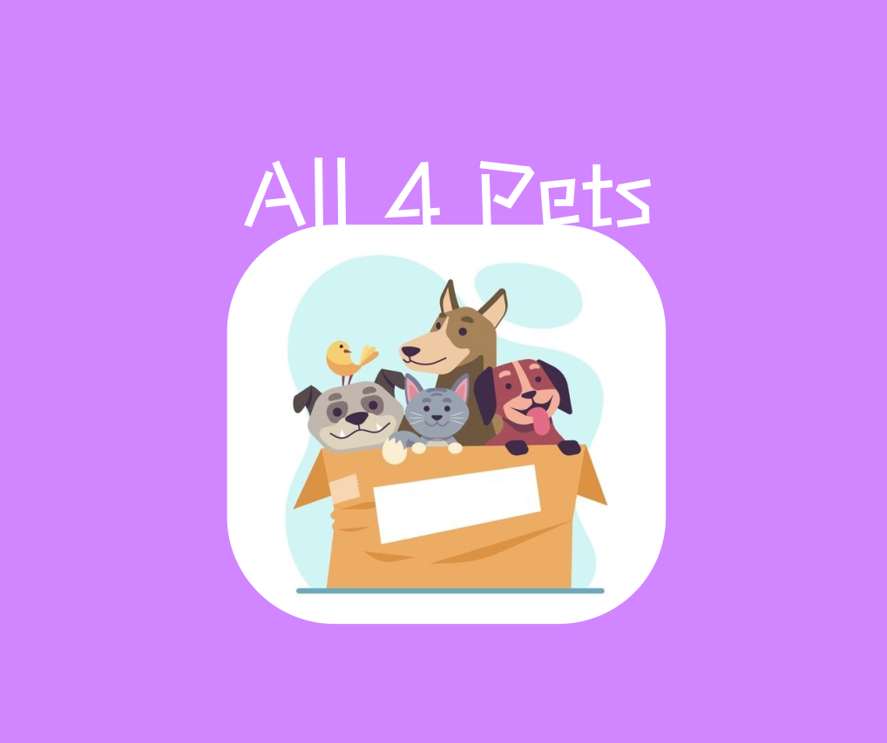

# All4Pets

O projeto consiste na produção de um "Backend" do projeto anteriormente produzido para a disciplina
de Empreendedorismo,contando com a aplicação dos conceitos de Programação orientada a objetos, Prototipagem e Webservices

All4Pets trata-se de uma ideia de uma gama de serviços destinado a Pets , tais como veterinário, passeador, hotel ,etc...

As classes e o projeto completo com a aplicação do Flask podem ser visualizados em suas respectivas pastas.
A UML do projeto se encontra abaixo, ao passo que a prototipagem do mesmo pode ser visualizada [aqui](https://www.figma.com/proto/hK4p19oLP03RZ9vYCltHrA/All-4-Pets?node-id=1%3A2&scaling=scale-down&page-id=0%3A1&starting-point-node-id=1%3A2), ou dentro do link que se encontra no arquivo txt da respectiva pasta.

.jpg?raw=true)